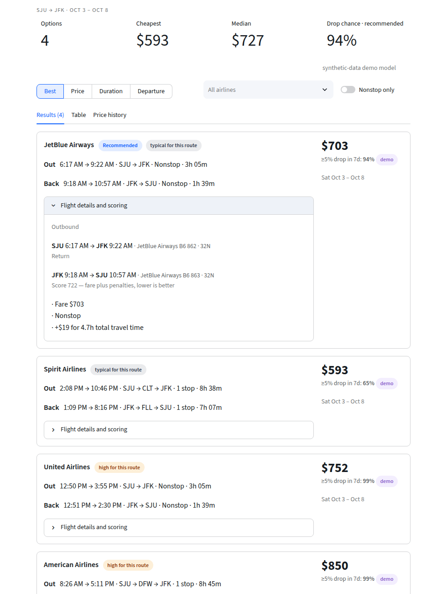
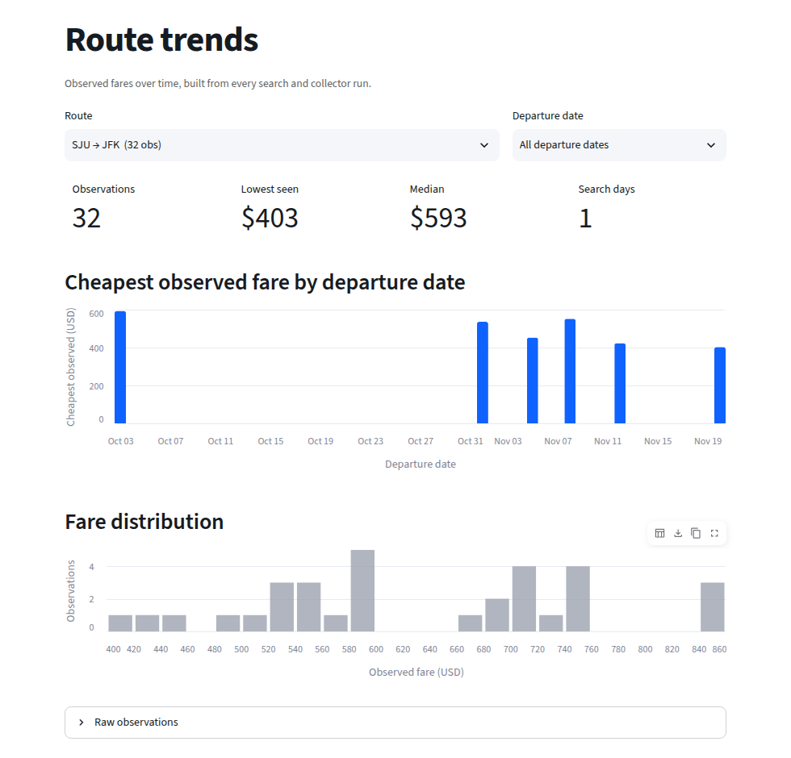
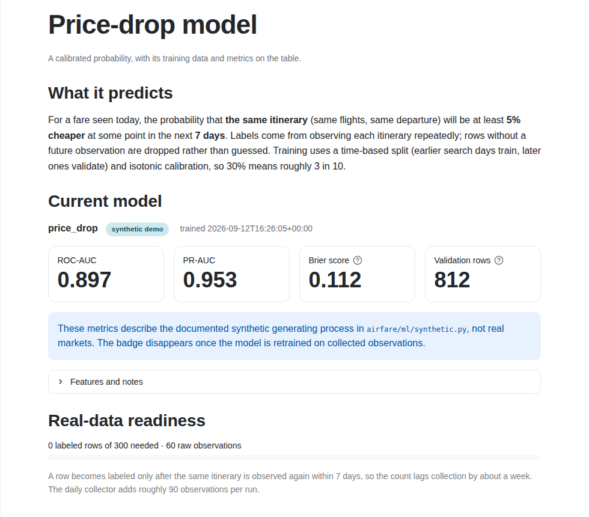

# Airfare Marketplace

[](https://github.com/jfontanet5/airfare_marketplace/actions/workflows/ci.yml)


A transparent airfare intelligence engine: provider-agnostic flight search, deterministic
itinerary identity, USD-normalized price history, and a calibrated price-drop signal —
built to show how a production airfare system is structured, not just how to call an API.

**Live demo:** https://airfare-marketplace.streamlit.app (offline demo data; seeded with collected history)

Runs fully offline out of the box. Add a SerpApi key for live Google Flights fares.

<p align="center"></p>

## Why

Consumer fare sites obscure how a price got to where it is: results are personalised,
currencies are mixed, history is invisible, and "buy now" nudges have no stated basis.
This project builds the pieces needed to answer *is this a good price for this route,
right now?* with data the user can inspect:

| Problem | Design response |
| --- | --- |
| Every source returns a different shape | Canonical `Offer → Itinerary → Segment` model; providers are translated at one boundary |
| Same flight appears many times | Deterministic `signature` hashed from the segment chain; dedup keeps the cheapest |
| Prices quoted in mixed currencies | `Price(amount, currency, usd, fx_rate, fx_as_of)` normalized once per search-day; never silently mislabeled |
| No memory of past prices | Every search writes observations to a versioned SQLite store; trends and route percentiles come from it |
| "Buy or wait" is a black box | Scoring is a USD-equivalent cost with human-readable reasons; the ML signal ships with a model card |

## Architecture

```
airfare/
├── config.py            pydantic-settings; every credential optional
├── domain/              models, signature (identity + dedup), scoring
├── providers/           base contract + error taxonomy, registry
│   ├── mock.py          deterministic offline provider (segments, layovers, EUR/USD mix, duplicates)
│   ├── replay.py        replays the last stored snapshot for a route
│   └── serpapi/         client (retry/backoff, typed errors) · parser (pure) · provider (Google Flights)
├── services/
│   ├── normalization.py the one place raw offers become canonical offers
│   ├── fx.py            daily FX to USD; Twelve Data → Frankfurter/ECB fallback; SQLite cache
│   ├── airports.py      bundled commercial airports + optional full OurAirports refresh
│   └── search.py        SearchService: provider → normalize → score → persist → SearchResult
├── storage/             PriceHistoryRepository protocol + SQLite impl with versioned migrations
├── ml/                  features (shared by train + inference), dataset builder, synthetic data, train, registry
├── collect/             airfare-collect: watch-list snapshots, CSV partitions, request budget
└── ui/                  Streamlit app: Search · Route trends · Model · About (thin: calls SearchService only)
```

Data flow for one search:

```
SearchQuery ─▶ Provider.search() ─▶ [raw Offer, priced in provider currency]
           ─▶ normalize_offers()   FX → USD · signature · constraints · dedup
           ─▶ score_offers()       fare + stop/date/duration penalties, with reasons
           ─▶ history.record()     top-N observations (signature, search_ts) unique
           ─▶ SearchResult         offers · ranked · recommended · cheapest · warnings
```

Key decisions (ADR-style):

* **Normalize at the boundary, once.** Earlier versions carried native amounts in a field
  named `total_price_usd` and converted in three places. Now `Price.usd` is either a real
  USD figure with the rate and date that produced it, or `None` — and every consumer handles
  `None` instead of guessing.
* **Identity is a hash of the segment chain**, not a provider ID. The same physical flight
  plan from two providers, or on two days, maps to one signature, which is what makes
  per-itinerary price history possible.
* **Providers return raw offers and raise typed errors.** `ProviderAuthError`,
  `ProviderRateLimitedError`, `ProviderUnavailableError` let the UI say something useful;
  transient failures are retried with jittered backoff inside the client.
* **The live provider has already been swapped once.** The first live integration was the
  Amadeus Self-Service API (OAuth2, EUR-priced test data). Amadeus decommissioned that
  program in July 2026; replacing it with SerpApi's Google Flights engine touched one
  provider package and the registry — nothing in domain, services, storage, ML, or UI.
  Observations collected under Amadeus remain in the history store, tagged by provider.
* **Storage is a protocol.** `SqlitePriceHistory` is the default and migrates the pre-0.5
  schema in place; a Postgres implementation would slot in without touching services.
* **Features are defined once.** `ml/features.py` builds the same row for training and
  inference, so the encoder can never see names at train time and codes at predict time.

## Quick start

```bash
git clone https://github.com/jfontanet5/airfare_marketplace.git
cd airfare_marketplace
make install        # Python 3.12 venv + editable install with dev extras
make train          # trains the demo price-drop model into models/
make run            # http://localhost:8501 — offline demo data works immediately
```

Or with Docker: `make docker-build && make docker-run`.

### Live fares

Copy `.env.example` to `.env` and set `SERPAPI_API_KEY` (sign up at
[serpapi.com](https://serpapi.com); the free plan includes a small monthly search quota).
Each search costs one request. For round trips, Google prices the whole trip on the
outbound leg; set `SERPAPI_RETURN_LEGS_TOP_N=3` to also fetch the matching return
itinerary for the three cheapest options (one extra request each), or leave it at `0`
to keep every search to a single request. `TWELVEDATA_API_KEY` is optional — without
it, FX comes from the keyless Frankfurter (ECB) API.

### Development

```bash
make check          # ruff (lint + format), mypy --strict, pytest with coverage
make fmt            # auto-format and fix imports
```

CI runs the same `check` target plus a Docker build on every push and pull request.

### Deploying

The app is self-sufficient on a fresh clone: it seeds its history store from the committed
CSV partitions in `data/observations/` and trains the synthetic demo model on first start
if `models/` is absent. On Streamlit Community Cloud point the app at `airfare/ui/app.py`
(dependencies come from `requirements.txt` → `pyproject.toml`); add `SERPAPI_API_KEY` to the
app's secrets to enable live search there. `make docker-build && make docker-run` does the
same in a container.

## The app

| Search | Route trends | Model |
| --- | --- | --- |
| Ranked itinerary cards with full segments and layovers, USD price with the native quote and FX rate, a "why recommended" breakdown, price-position badge (low / typical / high vs. the route's history), sort and airline filters, and the price history for the searched date. | Every route the store knows: cheapest fare by departure date, fare distribution, per-departure-date price-over-time with a per-itinerary movement table, raw observations with CSV download. | What the signal means, the model card (source, metrics, features), and real-data readiness — how many labeled rows exist toward the training threshold. |
|  |  |  |

## Machine learning

The app shows *chance of a ≥5% drop within 7 days* for each fare.

**Current model — synthetic demo.** `airfare/ml/synthetic.py` documents a simple
generating process (a latent floor fare with a markup that grows with days-to-departure and
carrier). The model is a calibrated `HistGradientBoostingClassifier` trained with a
**time-based split** and saved with a model card (`models/price_drop/card.json`) that records
data source, row counts, features, and validation metrics. The UI labels it as a
synthetic-data demo. Its metrics describe that synthetic process, not real markets.

**Real model.** `airfare-collect` snapshots a watch-list of routes daily (see
[docs/collector.md](docs/collector.md)); `ml/dataset.py` turns the observations into
labeled rows — one per (itinerary signature, search day), label = the same itinerary's
price fell ≥5% within the next 7 days, censored rows dropped — and `make train-real`
runs the same split, calibration and model-card pipeline on them. Until enough history
exists, a non-ML **price position** badge (low / typical / high vs. the route's observed
p25–p75) works from the first few searches.

## Roadmap

- [x] Scheduled route collector (`airfare.collect`) and observation-based dataset builder
- [ ] Turn on the daily collection schedule and retrain on real observations
- [ ] Response cache for live searches (schema table already exists)

## Author

Julio Fontanet — Data Scientist · [github.com/jfontanet5](https://github.com/jfontanet5)
